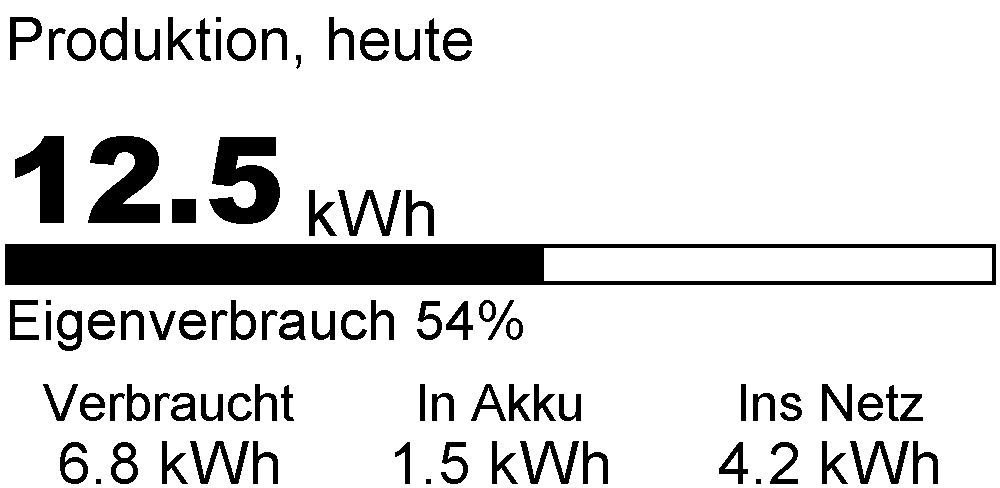
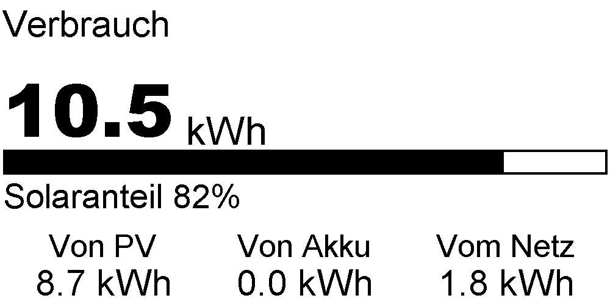
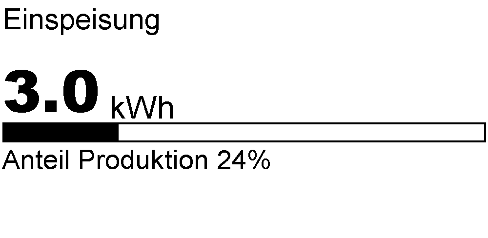
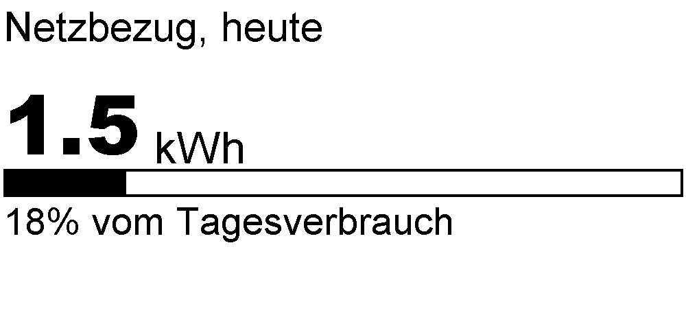
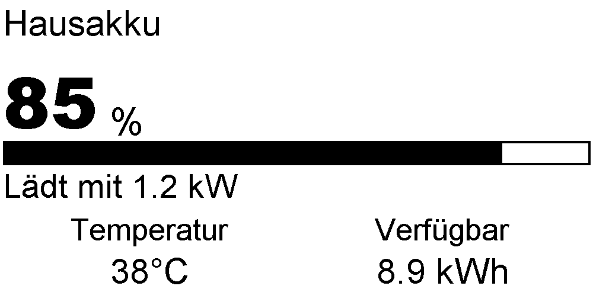
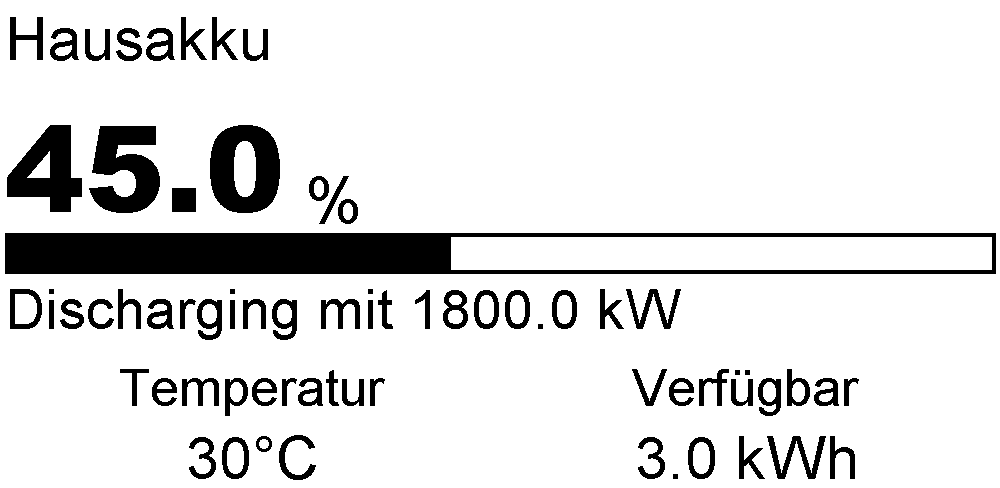
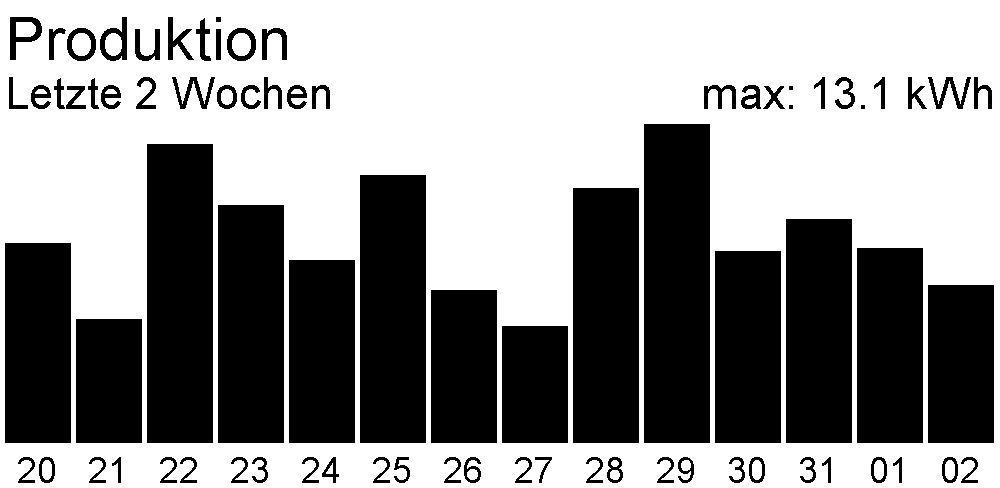
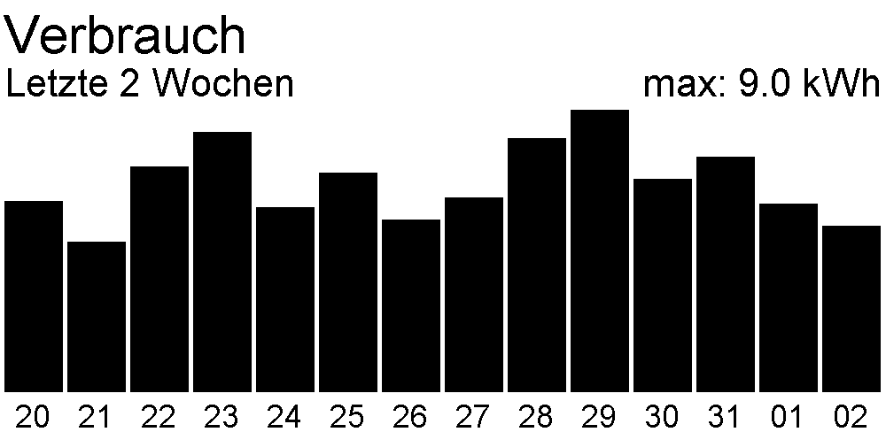
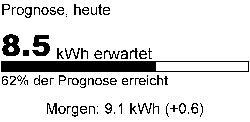

# SolarEdge Off-Grid Monitor

A Raspberry Pi-powered e-ink display that shows your SolarEdge solar energy data at a glance — production, consumption, grid feed-in, purchased energy, battery state, solar forecast, and 2-week history.

The display cycles through up to 9 screens, each showing a daily energy metric with a proportional bar and breakdown, plus a solar forecast screen powered by Forecast.Solar, and two 14-day histogram screens. The battery and forecast screens are optional — battery is auto-detected at startup, forecast is enabled when configured. Updates every 5 minutes. Sleeps at night. Runs as a systemd service on your Pi.

## Screens

| Produktion | Verbrauch |
|:---:|:---:|
|  |  |
| **Einspeisung** | **Netzbezug** |
|  |  |
| **Hausakku (Laden)** | **Hausakku (Entladen)** |
|  |  |
| **Verlauf Produktion** | **Verlauf Verbrauch** |
|  |  |
| **Prognose** | |
|  | |

## Hardware

| Part | Model |
|------|-------|
| Computer | Raspberry Pi Zero WH v1.1 (1 GHz, 512 MB RAM, WLAN, BT)
| Display | DEBO EPA 2.1 — 2.13" e-paper, black/white (Waveshare compatible)
| Power supply | Official RPi PSU, 5.1V / 2.5A, micro-USB
| Storage | SanDisk Ultra microSDXC 64GB

Total: ~CHF 49

## How It Works

1. **Fetches energy data** from the SolarEdge monitoring API every 5 minutes
2. **Renders screens** at 4x resolution (1000x488) using PIL for high-quality output
3. **Downsamples to 250x122** with LANCZOS resampling for crisp e-ink text
4. **Cycles through screens** on the display (Production → Consumption → Feed-in → Purchased → Battery if installed → Forecast if configured → History)
5. **Sleeps between midnight and 6 AM** when there's no solar production

## Prerequisites

Before you start, you'll need:

- **Raspberry Pi Zero WH** with Raspberry Pi OS and SSH access
- **Python 3.9+** (pre-installed on Raspberry Pi OS)
- **SolarEdge monitoring account** with API access
- **SolarEdge API key** ([how to get one](https://knowledge-center.solaredge.com/sites/kc/files/se_monitoring_api.pdf))
- **SolarEdge site ID** (found in your monitoring portal URL)

## Quick Start (Raspberry Pi)

The fastest way to get running on your Pi is to use the install script:

```bash
# Clone the repository
git clone https://github.com/YOUR_USERNAME/solaredge-offgrid-monitor.git /home/pi/solaredge-monitor
cd /home/pi/solaredge-monitor

# Run the install script (sets up everything: SPI, venv, service)
./install.sh

# Edit your credentials
nano .env

# Start the service
sudo systemctl start solaredge-monitor
```

The install script will:
- Enable SPI interface (required for the display)
- Create a Python virtual environment
- Install dependencies
- Set up the systemd service
- Create an .env file from the template

## Configuration

All configuration is managed through environment variables in the `.env` file.

Copy `.env.example` to `.env` and configure:

| Variable | Required | Default | Description |
|----------|----------|---------|-------------|
| `SOLAREDGE_API_KEY` | Yes | — | Your SolarEdge API key |
| `SOLAREDGE_SITE_ID` | Yes | — | Your SolarEdge site ID |
| `SOLAREDGE_POLL_INTERVAL` | No | `5` | Minutes between API polls (minimum: 1) |
| `SOLAREDGE_SLEEP_START` | No | `0` | Hour to pause polling (0-23, 0 = midnight) |
| `SOLAREDGE_SLEEP_END` | No | `6` | Hour to resume polling (0-23, 6 = 6 AM) |
| `SOLAREDGE_DEBUG` | No | `false` | Enable debug mode (saves PNG files instead of using display) |
| `SOLAREDGE_LOG_LEVEL` | No | `INFO` | Log level: DEBUG, INFO, WARNING, ERROR, CRITICAL |
| | | | **Solar Forecast** (optional) |
| `FORECAST_LAT` | No | — | Latitude of solar installation (-90 to 90) |
| `FORECAST_LON` | No | — | Longitude of solar installation (-180 to 180) |
| `FORECAST_TILT` | No | — | Panel tilt angle in degrees (0 = horizontal, 90 = vertical) |
| `FORECAST_AZIMUTH` | No | — | Panel orientation in degrees (-180 to 180, 0 = south, -90 = east, 90 = west) |
| `FORECAST_KWP` | No | — | Installed peak power in kilowatt-peak (kWp) |

**Note:** The forecast screen uses the free [Forecast.Solar](https://forecast.solar) API (no API key required). All 5 forecast variables must be set to enable the forecast screen.

Example `.env`:

```env
SOLAREDGE_API_KEY=your_api_key_here
SOLAREDGE_SITE_ID=your_site_id_here
SOLAREDGE_POLL_INTERVAL=5
SOLAREDGE_SLEEP_START=0
SOLAREDGE_SLEEP_END=6
SOLAREDGE_DEBUG=false
SOLAREDGE_LOG_LEVEL=INFO

# Solar Forecast (optional — uncomment and fill to enable)
# FORECAST_LAT=48.1351
# FORECAST_LON=11.5820
# FORECAST_TILT=30
# FORECAST_AZIMUTH=0
# FORECAST_KWP=9.8
```

## Development (without hardware)

You can test the monitor without a Raspberry Pi or e-ink display using debug mode.

Debug mode renders screens to PNG files in the `debug/` folder instead of driving the display:

```bash
# Install dependencies
python3 -m venv venv
source venv/bin/activate
pip install -r requirements.txt

# Copy and configure .env
cp .env.example .env
nano .env

# Run in debug mode
SOLAREDGE_DEBUG=true python3 main.py
```

Check the `debug/` folder for PNG output files showing what would appear on the display.

## Deployment

After initial setup, use the deploy script to update the monitor with code changes:

```bash
ssh pi@raspberrypi
cd /home/pi/solaredge-monitor
./deploy.sh
```

The deploy script will:
- Pull the latest code from git
- Install/update dependencies
- Restart the systemd service

## Useful Commands

Quick reference for managing the monitor service:

```bash
# Check service status
sudo systemctl status solaredge-monitor

# Follow live logs
journalctl -u solaredge-monitor -f

# View recent logs (last 50 lines)
journalctl -u solaredge-monitor -n 50

# Stop the service
sudo systemctl stop solaredge-monitor

# Start the service
sudo systemctl start solaredge-monitor

# Restart the service
sudo systemctl restart solaredge-monitor

# Disable service (won't start on boot)
sudo systemctl disable solaredge-monitor

# Enable service (starts on boot)
sudo systemctl enable solaredge-monitor
```

## Troubleshooting

### Service won't start

**Check the logs:**
```bash
journalctl -u solaredge-monitor -n 20
```

**Common causes:**
- Missing or invalid `.env` configuration (check `SOLAREDGE_API_KEY` and `SOLAREDGE_SITE_ID`)
- Invalid log level in `SOLAREDGE_LOG_LEVEL` (must be DEBUG, INFO, WARNING, ERROR, or CRITICAL)
- Missing dependencies (run `./deploy.sh` to reinstall)

### "Permission denied" on SPI

The display requires SPI access. Fix with:

```bash
# Enable SPI
sudo raspi-config
# → Interface Options → SPI → Enable
sudo reboot

# Add user to required groups
sudo usermod -a -G spi,gpio pi
```

### "start request repeated too quickly"

This means the service is crashing immediately after startup. Check logs:

```bash
journalctl -u solaredge-monitor -n 50
```

Usually caused by:
- Python exceptions on startup (check for typos in .env)
- Import errors (missing dependencies)
- Invalid API credentials

### Blank display

**Verify the service is running:**
```bash
sudo systemctl status solaredge-monitor
```

**Check SPI wiring:**
- Display connected to GPIO pins as per Waveshare documentation
- SPI enabled in `raspi-config`

**Check logs for errors:**
```bash
journalctl -u solaredge-monitor -f
```

### API rate limiting

SolarEdge has rate limits on their API. If you see 429 errors in logs:

- Increase `SOLAREDGE_POLL_INTERVAL` in `.env` (default: 5 minutes)
- The monitor automatically retries with exponential backoff

## Project Structure

```
.
├── main.py                    # Entry point — polling loop and screen cycling
├── config.py                  # Environment-based configuration
├── solaredge_api.py           # SolarEdge API client with retry logic
├── models.py                  # Data models (PowerFlow, EnergyDetails, EnergyHistory, SiteOverview, BatteryData, ForecastData)
├── display.py                 # Display abstraction (e-ink / PNG debug mode)
├── forecast_api.py            # Forecast.Solar API client with TTL caching
├── logging_setup.py           # JSON logging configuration (stdout + rotating file)
├── screens/                   # Screen renderers (one per display screen)
│   ├── __init__.py           # Screen registry
│   ├── production.py         # Produktion — daily production + breakdown
│   ├── consumption.py        # Verbrauch — daily consumption + sources
│   ├── feed_in.py            # Einspeisung — grid feed-in
│   ├── purchased.py          # Bezug — grid purchase
│   ├── battery.py            # Hausakku — battery state (auto-detected)
│   ├── forecast.py           # Prognose — solar production forecast
│   ├── history.py            # Verlauf — 14-day production/consumption histograms
│   └── error.py              # Error screen (API failures)
├── rendering/                 # Drawing primitives (fonts, icons, bars)
│   ├── fonts.py              # Font loading and caching
│   ├── icons.py              # Icon drawing (solar, house, grid, battery)
│   └── bars.py               # Horizontal bar charts with legends
├── fonts/                     # Arial, ArialBlack (bundled for Pi)
├── lib/waveshare_epd/         # Waveshare e-ink driver (epd2in13_V3)
├── install.sh                 # Initial Pi setup script
├── deploy.sh                  # Update deployment script
├── solaredge-monitor.service  # systemd service definition
├── .env.example               # Configuration template
└── requirements.txt           # Python dependencies
```

## License

MIT
